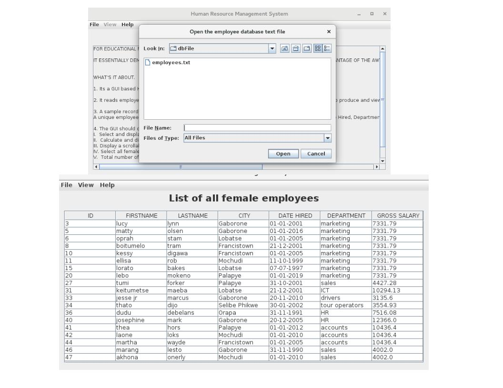

# HUMAN RESOURCE MANAGEMENT SYSTEM (HRMS)

HRMS is a java application that takes advantage of the JAVA IO package to read from a file. The contents of the file are displayed within a graphical user Interface (GUI) taking advantage of SWING & AWT packages contained in the JAVA API.

### Features

A detailed description of [features](https://github.com/timothymonyake/HRMS/blob/master/additionalFiles/features.md) is also available.

- Object Oriented Programming (OOP)
    - Abstract Class
    - Inheritance
    - Separation of classes (concerns)
    - Interfaces
- File Reading
    - Buffered Reader
    - File Reader
    - File class
- Basic Exception Handling
    - try - catch blocks
    - custom error messages
- Java GUI with Swing and AWT
    - Components (JButtons, JTextFiels, JLabels etc)
    - Containers (JFrame & JPanel)
    - Helper Classes (Fonts , Borders ,Colors )
    - Action & Events Listeners
      - creating an anonymous action event class

### Installation
> This article assumes you have installed **Java** JDK or JRE, if not please search google and get your java environment up and running.

Extended Installation instructions can be found [here](https://github.com/timothymonyake/HRMS/blob/master/additionalFiles/installation.md).
In quick short steps :

1. Run the project from the __MainClass.java__ file.

Should you experience problems installing or using the HRMS,please [open a new issue](https://github.com/timothymonyake/HRMS/issues).

### Usage

1. Open employee database text file using __File__ Menu
2. Once opened the __View__ menu will now be active.
3. Switch through views using menu items.

### Contributing
Please see [contributing.md](https://github.com/timothymonyake/HRMS/blob/master/additionalFiles/contributing.md)

### License
Human Resource Management System (HRMS) - is released under the [GPLv3 License](https://github.com/timothymonyake/HRMS/blob/master/LICENSE)
